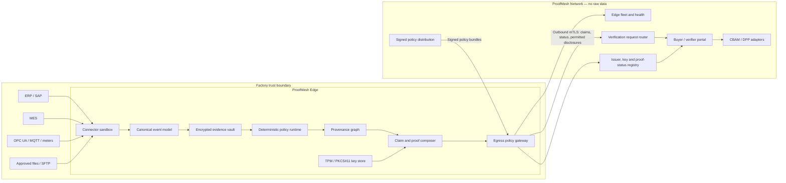

# STR ProofMesh — Product Blueprint

Status: Initial product architecture  
First vertical: Steel and aluminium exports to the European Union  
First proof type: Privacy-preserving product carbon and CBAM evidence  

## 1. Product thesis

European trade increasingly requires product-level, machine-readable and verifiable information. Manufacturers, however, cannot expose production recipes, energy consumption, supplier relationships or commercial data to every buyer and software provider.

ProofMesh resolves that conflict:

> Prove the required claim without moving the factory's raw data.

ProofMesh is not a generic reporting dashboard and not a document-upload product. It is a distributed trust infrastructure with two main surfaces:

- **ProofMesh Edge:** Runs inside the factory network, reads authorised operational data, executes signed calculation policies and seals the evidence locally.
- **ProofMesh Network:** Distributes policies, manages identities and proof status, routes verification requests and exposes only authorised claims. It does not receive raw factory data by default.

CBAM is the first policy pack, not the whole product. The same trust layer can later issue Digital Product Passport, battery passport, recycled-content, renewable-origin and product-compliance claims.

## 2. Non-negotiable product principles

1. **Raw data stays at the source by default.**
2. **No inbound factory port is required.** Edge initiates all external communication over outbound mTLS.
3. **Every result is reproducible.** A proof identifies its input evidence root, policy version, emission-factor version and signer.
4. **Disclosure is audience-specific.** A buyer, verifier and customs authority may receive different views of the same proof.
5. **Evidence quality is visible.** A manually entered value must never look equivalent to a meter-originated or verifier-attested value.
6. **No blockchain dependency.** A ledger may be added only where it solves a concrete multi-party trust problem.
7. **Cryptographic agility.** ProofMesh must be able to replace signing and selective-disclosure algorithms without changing its domain model.
8. **AI may map and explain data; it may not silently decide regulated calculations.** Regulatory outputs come from deterministic, versioned policies.

## 3. First product story

An aluminium producer in Türkiye sells batch `AL-2026-00418` to an EU importer.

The importer needs evidence that the batch's embedded emissions were calculated with the applicable methodology. The producer does not want to share interval meter readings, production volumes, supplier contracts or process recipes.

ProofMesh Edge:

1. Detects the completed batch from MES or an approved hot-folder export.
2. Binds the batch to production lines, time windows, input materials and energy sources.
3. Reads authorised measurements locally.
4. Executes the signed CBAM policy pack.
5. Creates a tamper-evident local evidence manifest.
6. Issues a signed claim containing the permitted result and assurance level.
7. Answers a verifier challenge without sending the raw evidence set to ProofMesh Network.

The importer receives a result such as:

> Batch `AL-2026-00418` was evaluated with policy `EU-CBAM-AL-2026.3`; the disclosed embedded-emissions value is valid, the underlying evidence has not changed, and the claim was co-signed by verifier `V-104`.

## 4. System architecture



### 4.1 ProofMesh Edge components

| Component | Responsibility |
| --- | --- |
| Connector sandbox | Reads from authorised sources using least-privilege, read-only credentials. Connectors run isolated from the core agent. |
| Canonical event model | Converts vendor-specific records into facilities, assets, meters, batches, materials, energy lots and evidence events. |
| Evidence vault | Stores encrypted raw evidence locally and maintains an append-only integrity log. |
| Policy runtime | Executes signed, deterministic calculation modules with fixed decimal arithmetic and no network access. |
| Provenance graph | Records which sources, transformations and allocation rules produced each output. |
| Claim composer | Produces signed credentials, disclosure views and verifier challenge responses. |
| Device identity | Protects the Edge private key with TPM 2.0 or PKCS#11 where available. |
| Egress gateway | Enforces a machine-readable allowlist of fields permitted to leave the factory. |
| Update manager | Accepts only signed agent, connector and policy updates; retains rollback and audit history. |

### 4.2 ProofMesh Network components

The network stores operational metadata, never raw factory evidence by default:

- Edge identity, version and health
- Public keys and issuer credentials
- Signed policy bundles and validity periods
- Proof identifiers, hashes, status and revocation data
- Verification requests and access grants
- Explicitly authorised disclosed values
- DPP and CBAM export mappings

## 5. Data boundary

| Data class | Default location | May leave the factory? |
| --- | --- | --- |
| Meter time series | Edge vault | No |
| Production recipe and process parameters | Edge vault | No |
| ERP commercial records and supplier prices | Edge vault | No |
| Personal data | Edge vault or excluded at connector | Only where legally required and explicitly configured |
| Production quantity | Edge vault | Only when a specific policy and recipient require it |
| Embedded-emissions result | Edge vault | Yes, through an approved disclosure view |
| Evidence Merkle root | Edge and Network | Yes |
| Policy and factor-set version | Edge and Network | Yes |
| Issuer, verifier and device identity | Edge and Network | Yes |
| Proof status and revocation | Network | Yes |

“Data stays local” is not an absolute marketing fiction. Statutory fields required by a regulator may be disclosed. ProofMesh guarantees that unrequired source data is not silently collected or exported.

## 6. Evidence assurance model

Every output receives an assurance profile rather than a vague “verified” badge.

| Level | Name | Meaning |
| --- | --- | --- |
| A0 | Self-declared | Entered manually; source document may exist but is not system-bound. |
| A1 | System-derived | Read directly from an authorised ERP, MES or structured source. |
| A2 | Device-origin | Bound to a known meter or device, calibration record and acquisition time. |
| A3 | Independently attested | Evidence and method reviewed or co-signed by an authorised independent verifier. |

A claim may contain mixed evidence levels. Its final assurance profile must expose the weakest material input and any unresolved gaps.

## 7. Proof object

A ProofMesh claim should be understandable without exposing its evidence:

```json
{
  "proofId": "pm:proof:01JZAL202600418",
  "subject": {
    "type": "ProductBatch",
    "id": "AL-2026-00418",
    "product": "Aluminium billet 6063"
  },
  "claim": {
    "type": "EmbeddedEmissions",
    "value": 1.62,
    "unit": "tCO2e/t",
    "disclosure": "buyer"
  },
  "method": {
    "policy": "EU-CBAM-AL-2026.3",
    "policyHash": "sha256:…",
    "factorSet": "EU-FACTORS-2026.2"
  },
  "evidence": {
    "root": "sha256:…",
    "assurance": "A2",
    "retainedAt": "edge:TR-31-ALU-01"
  },
  "issuer": "did:web:manufacturer.example",
  "validFrom": "2026-07-09T00:00:00Z",
  "status": "https://proofmesh.eu/status/…",
  "proof": {
    "type": "cryptographically-agile-signature"
  }
}
```

The production format can use W3C Verifiable Credentials and an EU-compatible selective-disclosure format. The product model must not depend on one proof algorithm.

## 8. Policy packs

A policy pack is a signed, versioned and deterministic program. It contains:

- Applicability rules by product, geography and date
- Required and optional inputs
- Unit conversions and decimal precision
- Allocation and fallback rules
- Emission-factor sources and versions
- Validation rules and materiality thresholds
- Required disclosures by recipient type
- Human-readable explanation templates
- Test vectors with known outputs
- Effective date, expiry and signer

Calculation modules should run as sandboxed WebAssembly with no filesystem or network access. Access-control rules can use a separate policy language. Policy packs must be independently testable against official examples before release.

## 9. Trust and threat model

| Threat | Initial control |
| --- | --- |
| An operator edits a source record after proof creation | Append-only evidence log, evidence root and proof invalidation |
| A connector sends fabricated data | Source identity, read-only binding, plausibility checks and assurance downgrade |
| A policy is modified | Signed bundles, policy hash in every claim and pinned test vectors |
| A private key is stolen | TPM/PKCS#11 protection, rotation and revocation |
| A proof is replayed for another batch | Proof bound to unique product, batch, facility and validity interval |
| ProofMesh cloud is compromised | No raw evidence in cloud, outbound allowlist and independently verifiable signatures |
| Edge is offline | Local-first operation, queued status sync and explicit freshness information |
| Factory clock is manipulated | Trusted time source, monotonic event sequence and timestamp attestation where required |
| Validly signed but false input is used | Visible assurance level, calibration lineage and independent verifier co-signing |

## 10. User surfaces

### Factory Console

- Edge and connector health
- Data-source permissions
- Facility and production-line mapping
- Batch evidence completeness
- Policy execution trace
- Disclosure preview: “Exactly what will leave the factory?”
- Verification requests and time-limited access
- Key, update and audit status

### Verifier Workbench

- Verification queue
- Claim and policy version
- Evidence lineage summary
- Secure request for additional evidence
- Local or time-limited inspection session
- Findings, exceptions and co-signing

### Buyer / Importer Portal

- Scan or enter a proof identifier
- Verify signature, status and freshness
- View authorised claims
- Compare claim against procurement thresholds
- Request an additional disclosure
- Export a machine-readable evidence package

### Regulator and DPP adapters

- Map a ProofMesh claim to required official fields
- Export rather than claim direct registry integration until an official interface is available
- Preserve the original proof and policy lineage behind every exported value

## 11. First “wow” demonstration

The first public demo should tell one complete story in under three minutes:

1. A factory simulator streams meter and production events to a local Edge instance.
2. Batch `AL-2026-00418` closes in MES.
3. Edge calculates embedded emissions without uploading the source data.
4. The Factory Console shows the exact egress preview.
5. An EU buyer scans the batch QR and sees a valid disclosed result.
6. The buyer clicks “Why should I trust this?” and sees policy, issuer, source assurance and verifier status.
7. A source record is altered locally.
8. ProofMesh detects that the evidence root changed and marks the proof stale or revoked.

The memorable moment is not the carbon number. It is the visible contrast:

> Raw records disclosed: 0  
> Regulatory claim verified: 1

## 12. Delivery stages

### Stage 0 — Executable design

- Canonical model for facility, meter, batch, material and evidence
- Proof envelope and disclosure-view schema
- Threat model and egress rules
- Aluminium factory simulator
- One deterministic CBAM calculation test vector

### Stage 1 — Edge demonstration

- Single-node Edge runtime
- CSV hot folder, MQTT and OPC UA simulator connectors
- Encrypted local vault
- Signed policy execution
- Signed proof creation and verification
- Factory Console and public verifier page

Zero-knowledge proofs are deliberately not required for Stage 1. A signed claim with strict data minimisation proves the product flow before introducing expensive cryptographic machinery.

### Stage 2 — Real factory pilot

- One ERP/MES integration
- One real meter or energy-management integration
- TPM-backed device identity
- Remote signed updates
- Verifier workflow and co-signing
- CBAM evidence export package

### Stage 3 — European trust network

- Selective-disclosure and predicate proofs
- eIDAS-compatible organisational identity
- DPP Registry and sector adapter readiness
- Multi-verifier trust lists and revocation
- Steel, battery and recycled-content policy packs
- Independent security assessment and service-provider certification readiness

## 13. Product boundaries

ProofMesh will not initially:

- Replace an accredited CBAM verifier
- Provide a generic cloud document repository
- Promise that every DPP requirement is final before the relevant delegated acts and standards exist
- Store raw factory data centrally
- Use generative AI for regulated numerical decisions
- Serve every industry in the first release
- Build a proprietary data format that creates vendor lock-in

## 14. Initial technical direction

| Layer | Direction |
| --- | --- |
| Edge core | Rust service packaged as a signed OCI container and optional static service binary |
| Connector boundary | Sandboxed connector processes over local gRPC or Unix sockets |
| Local storage | Encrypted SQLite-compatible vault plus append-only integrity log for the first release |
| Calculation | Signed deterministic WebAssembly policy modules |
| Access control | Separate declarative egress and recipient-access policies |
| Transport | Outbound-only TLS 1.3 with mutual authentication |
| Device keys | TPM 2.0 first, PKCS#11 and OS keystore fallbacks |
| Credential model | W3C Verifiable Credentials-compatible envelope with cryptographic agility |
| Control plane | TypeScript services and the existing Next.js product surface |
| Observability | Health and operational metrics with strict field allowlisting; no raw payload logging |

## 15. Success criteria for the first pilot

- Edge can be installed without opening an inbound firewall port.
- Factory administrators can see and approve every field allowed to leave.
- The same evidence and policy version reproduce the same result.
- Modifying material evidence invalidates or supersedes the existing proof.
- A buyer can validate a proof without a ProofMesh account.
- The cloud environment contains no meter time series, invoice, recipe or raw ERP payload.
- A verifier can identify the origin and assurance level of every material input.
- The factory can remove ProofMesh and export its claims and audit history in open formats.

## 16. Standards and regulatory anchors

- [EU Ecodesign for Sustainable Products Regulation — Digital Product Passport requirements](https://eur-lex.europa.eu/legal-content/EN/ALL/?uri=celex%3A32024R1781)
- [European Commission — DPP Registry architecture](https://single-market-economy.ec.europa.eu/dpp-registry_en)
- [European Commission — CBAM verification](https://taxation-customs.ec.europa.eu/carbon-border-adjustment-mechanism/cbam-verification_en)
- [W3C Verifiable Credentials Data Model 2.0](https://www.w3.org/TR/vc-data-model/)
- [European Commission — EU Digital Identity Wallet implementation](https://digital-strategy.ec.europa.eu/en/policies/eudi-wallet-implementation)
- [European Commission — Battery Passport](https://single-market-economy.ec.europa.eu/batteries_en)

These anchors define compatibility targets, not a claim of certification or official endorsement.
